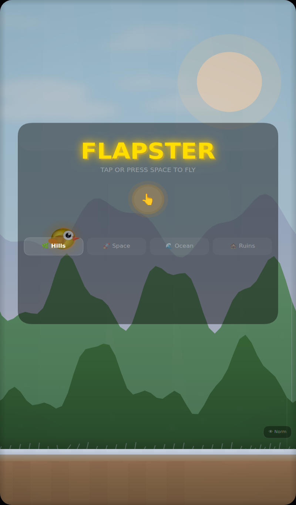
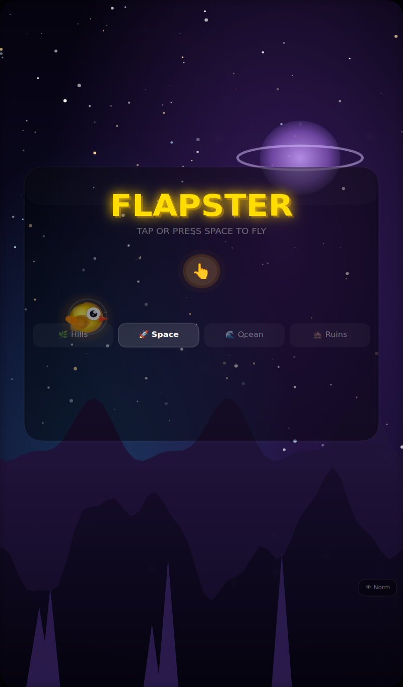
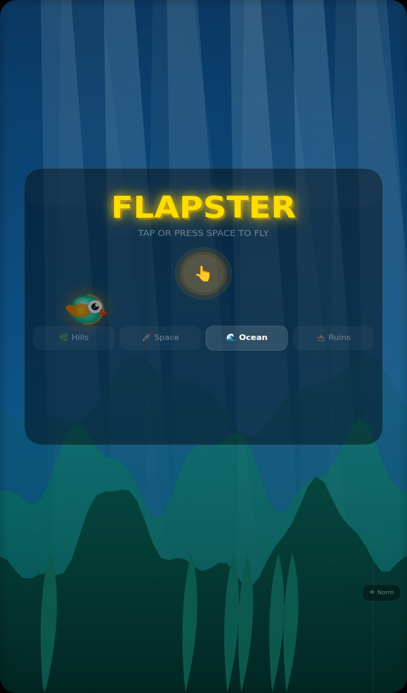
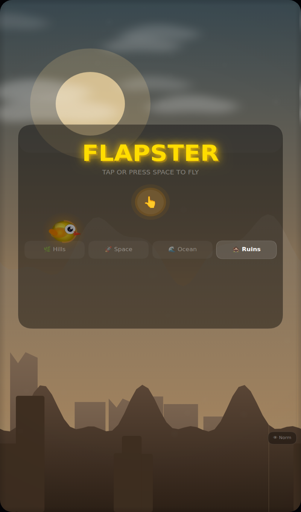
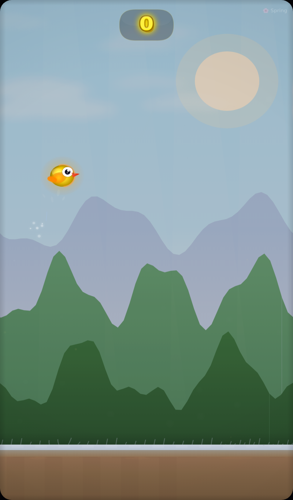
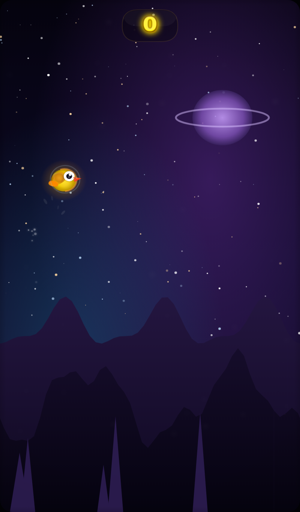
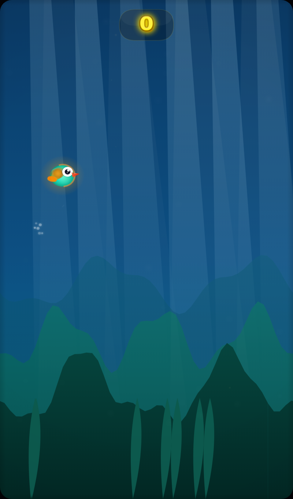

# Flapster

A high-polish, dependency-free HTML5 Canvas Flappy Bird game.

## Screenshots

| Hills | Space | Ocean | Ruins |
|:---:|:---:|:---:|:---:|
|  |  |  |  |

In-game (image parallax backgrounds, light shafts, atmosphere):

| Hills | Space | Ocean |
|:---:|:---:|:---:|
|  |  |  |

## Run it

The game now uses image assets from the `assets/` folder, so it must be served over HTTP
(opening the file directly via `file://` may block the asset loads in some browsers — the
game still runs in that case, falling back to its procedural renderer).

```bash
cd Game
python3 -m http.server 8000
# then open http://localhost:8000/flappy_aaa_v2.html
```

## Visual / audio assets

- **Parallax backgrounds** — each theme (hills / space / ocean / ruins) is built from 4
  scrolling image layers (`sky`, `far`, `mid`, `near`) with theme cross-fade transitions.
- **Atmosphere overlays** — drifting clouds, volumetric light shafts, and lens grit.
- **Themed game-over screen** — picks up each theme's backdrop and accent color.
- **Ambient music** — per-theme synthesized chord pads.
- Everything **gracefully falls back** to the original procedural rendering if an asset
  fails to load, so the game never hard-fails.

Assets are original **CC0** SVG art (see `assets/LICENSES.md`) generated by:

```bash
node tools/gen_assets.mjs
```

Edit that script to retheme, add layers, or tune colors, then re-run it.
